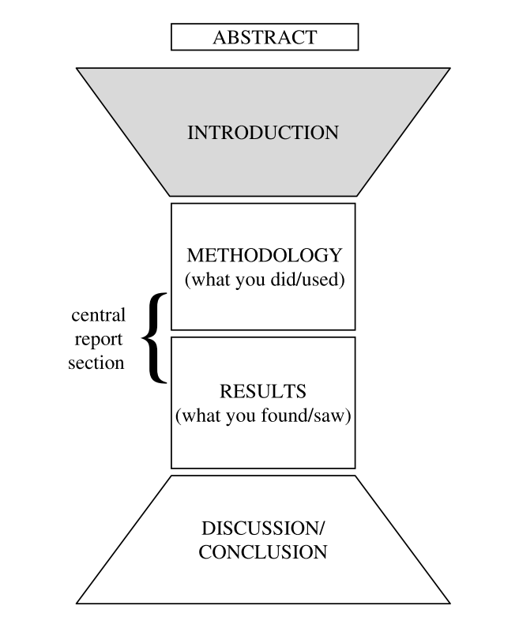

# Introduction

- The best time to write a intro. is after you have written the report.

- 会议的intro起始偏"the problem you are trying to solve"或者“the aim of your work”，但是期刊的起始偏"xxx has recieved much attention"或者"the significance"。

- 在读/仿写自己小领域的intro的时候要注意以下三个问题：

  - （1）一般怎么开头？“get in”
  - （2）intro需要包含哪些内容？这些内容的顺序是啥？
  - （3）一般怎么结束？“get out”

- Introduction是一个倒梯形，要从非常笼统慢慢缩小到你的重点。（Conclusion中恰好相反，要从一个小点拓展到非常笼统）

- 期刊的流程给我的感觉是这样的：重要性&定义&难点 + 过去工作&然而 little atrtention has paid to xxx + 本文提出了一种方法 + 这个方法实现怎么做的，实现了什么效果。

  

## 一、时态

- 一般现在时用来陈述"fact or truth"，一般介绍reference咋做的都用一般现在时（把他人工作当作fact or truth）。

- 在陈述自己的效果的时候可以用一般过去时或者一般现在时，用一般现在时显得更“strong”，因为你已经把你的成果当作了“fact or truth”。

  

## 二、Sentence Connection (Signaling language)

每句话的句号和下一句话开头的大写字母之间都是一个"dangerous space"。

- 方法一：可以通过“overlap”的方式让句子之间有逻辑连续性：

  *The pattern of inflammation during an asthma attack is different from that seen in **stable asthma**. **In stable asthma** the total number of inflammatory cells does not increase.*

- 方法二：用代词指代前面的话 (glue sentence together)：

  *Many researchers have suggested ways of reducing cost without affecting the quality of the image. **These methods** rely on data structures built during a preprocessing step.*

- 方法三：不完全结束，而是用"分号"或者"which"：（当两个句子相关性比较强，而且其中一个很短的时候，可以用which从句）

  *Th e procedure for testing whether components are operationally safe usually takes many hours**;** this means that tests are rarely repeated.*

  *It has received much attention over the past few decades due to its biodegradable properties, **which** offer important economic benefits.*

- 方法四：*therefore* 或者 *however*

  | words                 | meaning             |
  | --------------------- | ------------------- |
  | due to                | as                  |
  | on account of         | because             |
  | in view of            | since               |
  | therefore             | as a result         |
  | consequently          | which is why        |
  | hence                 | so                  |
  | however               | on the other hand   |
  | whereas               | while               |
  | but                   | by contrast         |
  | in addition           | also                |
  | moreover              | secondly            |
  | furthermore           | in the second place |
  | apart from that/which | what is more        |

  (千万别用so开启一个新的句子，这太不正式了)

  

## 三、分段

在速读一篇文章时（skim），通常只读每一段的第一句话，下图是 skim reading的步骤：

当你搞不清楚某一小节该怎么分段的时候，write down each idea/concept that you want to talk about, checking that they are in a logical order and then listing what you want to say about each, using bullet points.

## 四、Build a model for your Intro.

- 考虑一句话的作用—假设你删除这句话，会有啥信息缺失。（*Find out what the writer is doing rather than what he is saying.*）

作者给了个非常好的例子来介绍如何判断Intro的每一段该写啥：

- Sentence 1: **the writer establishes the importance of this research topic.**

  - 比如说 Much study in recent years or plays a major role
  - 可以现在完成时也可以一般现在时，"Must study in recent years has focused on..." 或者 "There are substantial benefits to be gained from ..."

- Sentence 2: **the writer provides general background information for the reader.(definition)**

  - 这里放简短有力的facts，具体放范围多大的取决于你的读者，这个就follow同领域论文就可以。
  - 如果有several background facts咋办？选择最general的, 即 a place where all your readers can start together. 记得在讲细节之前先给你的读者看整体：Show them the wall before you examine the bricks.
  - 如果你实在不知道fact写啥，就看看你的题目或者keywords，perhaps you can begin with a definition or a fact about one of those key works.
  - 这里还说了，如果不介绍significance和facts，上来就介绍我要解决的问题行不行，可以的，但是很多时候当你的读者没有背景知识的时候直接说问题是很懵逼的。

- Sentence 3: **Dose the same as in Sentences 1 and 2 but in a more specific/detailed way**

  不能见到reference就说开始介绍previous work了，这里也可以通过巨简短的refer介绍research focus的重要性的。这里的refer还是有点小重要的，他给了你的读者学习的机会，如果他读不懂了，可以去看这篇文章去学习。

- Sentence 4: **Describes the general problem area or the current research focus of the field**

  描述通有的问题或者是这个领域大家的focus，注意，写到这里，咱们还没提本文要deal with what，只是描述了：the current focus of the field, a rpoblem which many researchers in this field are interested in and **which leads to specific problem which will be addressed in this article.** 如果你研究的问题比较小众，记得挂一个参考文献，如果你研究的问题很大众，就不用了。（但是俺看顶会，大家第一段基本都不挂参考文献）

- Sentence 5: **A transition between the general problem area and the literature review**

  第一段的field及相对比较宽泛的问题过渡到文献review部分的小问题，一般的句式就是“*One way to thoughen is to ...*”

- Sentence 6: **Provides a brief review of key research projects in this area**

  这里罗列参考文献就完事儿了，但是要保证罗列的有逻辑，一般可以按照三种逻辑顺序：

  - 年份
  - 按照方法相似度划分
  - 从general到close to you的顺序

- Sentence 7: **Describes a gap in the research**

  这里就是你开始introduce你的paper的purpose and the specific problem you will deal with的地方，引入这个purpose或者problem可以通过（a）前作的problem；（b）there is a gap/空白；这句话前面通常加一个 However或者Although；通常这里不用问句，显得不专业（但是会议论文感觉也不care这些），你可以将其表述为你想验证的一个prediction或者hypothesis。（不要害羞去喷前人的工作，这里会用politeness的表达形式）

- Sentence 8: **The writer describes the paper itself**

  我们的工作的purpose/focus. 或者介绍我们工作的结构：“*This paper is organized as follows: xxx or this study focuses on xxx*”

- Sentence 9: **Details about the methodology reported in the paper**

- Sentence 10: **The writer announces the findings**

  methodology和results不要写的太详细，否则你会发现你methodology和results sections就没得写了。

上面的10个sentences可以被分为四部分：（tql，感觉丁哥写的intro是严格按照下面的格式的）

- 这本书罗列了很多在intro中常用的词，句式，感觉非常牛掰。还是按照上面的四个模块分别罗列的；

  